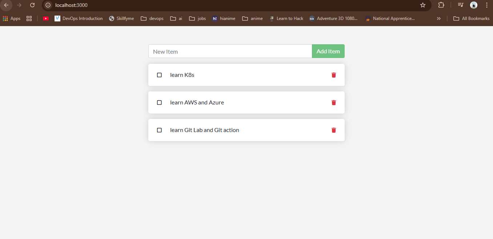

# Getting started

This repository is a sample application for users following the getting started guide at https://docs.docker.com/get-started/.

The application is based on the application from the getting started tutorial at https://github.com/docker/getting-started

Clone a sample git repository using the below command or use your project for the demo:
git clone https://github.com/docker/getting-started-app.git

cd into the directory:
cd getting-started-app/

Create an empty file with the name Dockerfile:
touch Dockerfile

Using the text editor of your choice, paste the below content:
FROM node:18-alpine
WORKDIR /app
COPY . .
RUN yarn install --production
CMD ["node", "src/index.js"]
EXPOSE 3000

Build the docker image using the application code and Dockerfile
docker build -t day02-todo .

Verify the image has been created and stored locally using the below command:
docker images

Create a public repository on hub.docker.com and push the image to remote repo:
docker login
docker tag day02-todo:latest username/new-reponame:tagname
docker images
docker push username/new-reponame:tagname

To pull the image to another environment , you can use below command:
docker pull username/new-reponame:tagname

To start the docker container, use below command:
docker run -dp 3000:3000 username/new-reponame:tagname

Verify your app. If you have followed the above steps correctly, your app should be listening on localhost:3000

To enter(exec) into the container, use the below command:
docker exec -it containername sh
or
docker exec -it containerid sh

To view docker logs:
docker logs containername
or
docker logs containerid